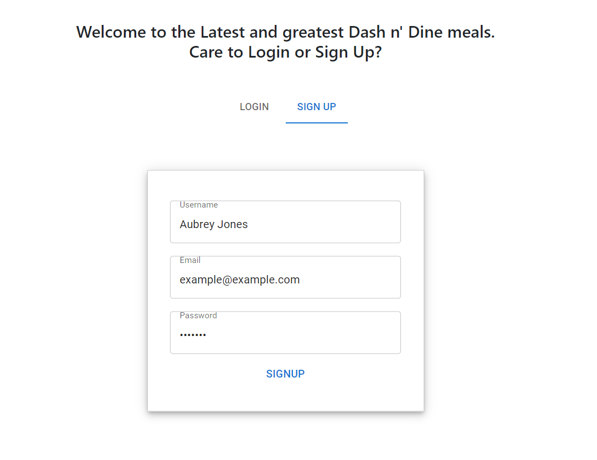
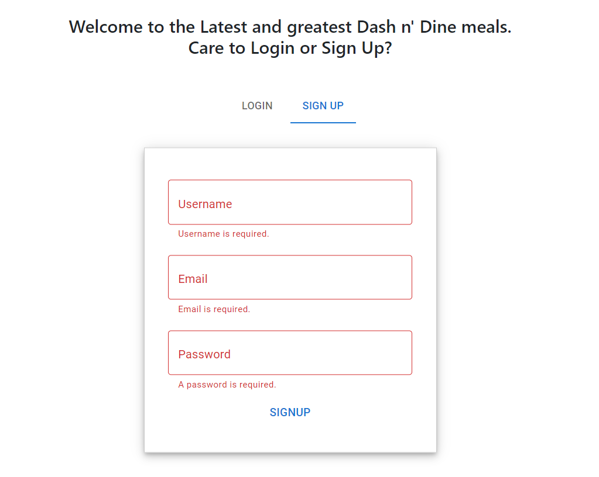
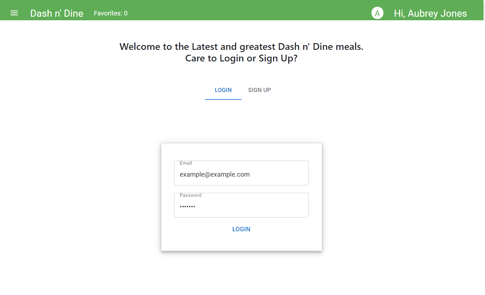
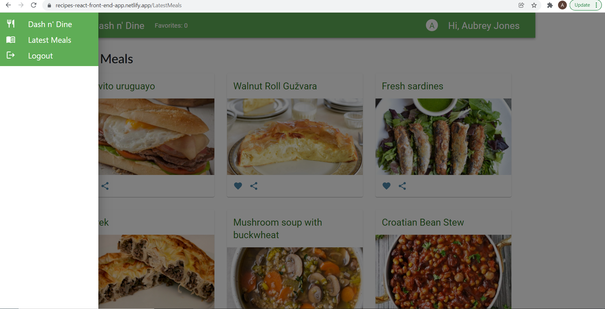

## This Github repository hosts a React front end app that demonstrates these project deliverables: 

## To Get Started, You'll Need to: 

1. Clone the repository 
2. Run NPM Install (to install project dependencies) 
3. Run NPM NetDev (to inject an api key and netlify functions)

* Note: If you need an api key, I use the 
https://www.themealdb.com/api.php API 

* Note: They do not have an API key parameter. I stored my API key in a .env file variable and then stored the ENV variable inside a global const variable . I could then add this const variable to my API async/await Netlify function.

## You Can Also Find My Deployed App Here: 

### https://recipes-react-front-end-app.netlify.app/

## Here are Key Project Deliverables to This Repository: 


1. Effectively use conditional logic and JavaScript array methods(e.g. Filter, Map, Reduce, Find) to render large lists.

To demonstrate JS array methods, I often use Filter and Map to display large lists of data. Here are examples from my User Dashboard page: 

Filtering through a useEffect React hook: 


``` 


  React.useEffect(() => {
    setfindFavorites((prevState) => {
      const finds = allMeals.filter((mealInfo) => favorites.includes(mealInfo.idMeal))
      console.log(finds)
      return [...prevState, ...finds]
    })
    
  }, [favorites, allMeals])


```


Mapping through an array of API data:  


``` 


<Box sx={{display: 'flex', justifyContent: 'center'}}>


{findFavorites.map((meal) => {
    return (

        
       
        <MealCard
        key={meal.idMeal}
        meal={{...meal}}
      
        />
        
    )
    
})}
    </Box>


```


2. Encapsulate your code as React functional components.

I chose to use updated React functional components as opposed to class based components so that I can implement React hooks throughout my code. Here is a small snippet of code from my NavBar component to demonstrate a functional component using an ES6 arrow function: 

``` 

const NavBar = () => {


  return (

      <>
      Data to return
      </>
  )

}


export default NavBar;


```


3. Work with command-line tools and NPM to create and manage your project within a real development toolset.

I used the command line interface to run my NPM scripts located in my package.json file. Visual studio code's terminal made this super easy and efficient. Especially when I could type "npm run netDev".  

```
 "scripts": {
    "netDev": "npx netlify dev",
    "start": "react-scripts start",
    "build": "react-scripts build",
    "test": "react-scripts test",
    "eject": "react-scripts eject"
  },


```


4. Allow communication between components using props and the Context API.

Creating a context API made this project super fun and efficient as I could connect to my API with several different arrays. You'll find my context API within the contexts folder. Here is an example of some of its code: 

```


const MealContext = React.createContext({


//categoryList: [],
mealList: [],
allMeals: [],
favorites: [], 


})


export const MealContextProvider = (props) => {


 // call the function
    return (
        <MealContext.Provider value={{
        mealList,
        allMeals,
        favorites,
        updateFavorites, 
        }}>
            {props.children}
        </MealContext.Provider>
    )
   


}

export const useMealContext = () => React.useContext(MealContext)


```


5. Present a form for user input that provides useful form validation and feedback for at least 3 data input items (e.g. name, password).

You need 3 data input items to sign up. They include: name, email, and password. 




If something goes wrong, I also provided feedback: 




6. Create at least 5 custom components and use them within at least two of your other components.

When you sign in, you can have access to more custom components. The Signup and login form components are actually built into the landing page component. And we can see the navigation component built into every page as well. 

Login and Signup Custom Components: 




Navigation custom component: 




7. Use a mix of CSS animations and Transition Component transitions to enhance some aspects of your project.

There's nothing quite like CSS animations and Transition Components to enhance a project: 

CSS Animation: 

```
 .cardAnimations:hover {

        transform: translate3D(0,-2px,0) scale(1.05);
        cursor: pointer;

    

    }
    


```

This transform:translate3D expands a card on hover to make it look clickable. And it sure is clickable to find more information. 


8. Connect to a server using Netlify functions and display retrieved data including at least 5 item details (accessed by details route) in your UI.

I love serverless Netlify functions! It makes APIs that much easier and that much more protected in your code. This is what you'd find in my infoData.js Netlify function: 

```

const axios = require('axios')

const APIKEY = process.env.MEAL_API_KEY


exports.handler = async function (event, context) {
    console.log(event)
    console.log(context) 
    try {
      //  const { querystring } = event.queryStringParameters
       // const { endpoint2 } = event.queryStringParameters
        const response = await axios.get(`https://www.themealdb.com/api/json/v2/${APIKEY}/latest.php`, {
     //   headers: {'api-key': process.env.MEAL_API_KEY}
    })
    return {
        statusCode: 200, 
        body: JSON.stringify(response.data)
    }
    } catch (err) {
        return {
            statusCode: 404, 
            body: err.toString()
        }
    }
}


```


9. Provide at least 3 different routes with navigation between them using React Router.

Routes are so nice when it comes to using React Router and expanding the idea behind React's single page application. Here are some route examples from my app.js file: 

```

 <Route path="/" exact component={LandingPage} />
  <Route path="/Welcome" exact component={Welcome} />
  <Route path="/UserDashboard" exact component={UserDashboard} />


```


10. Manage your application's general and signup/login Authentication state using Hooks and the Context API.

Where are we today without signup/login authentication? I used Formik, which is an excellent third party package manager and a great way to provide authentication. I also used the useIdentityContext() hook provided by the react-netlify-identity-gotrue third party package manager for authentication as well. You'll find my complete setup in the NavBar, SignUpForm, and LoginForm components. Here is a snippet of code for an example from the SignUpForm component. It demonstrates how to require a username, email, and password with minimum requirements: 


```
  validationSchema={
        Yup.object().shape({
          username: Yup.string()
          .min(4)
          .required('Username is required.'),
            email: Yup.string()
            .email('Must be a valid email.')
            .max(255)
            .required('Email is required.'),
            password: Yup.string()
            .min(6, 'Must include at least 6 characters.')
            .max(25, 'We KNOW your password isn' + 't more than 25 characters long.')
            .required('A password is required.'),
        })}


```


11. Structure, document, and deploy your final project code according to common industry practices.

I documented my project code according to the common Github industry practices. I committed and pushed often with clear commits. I also updated my repo's Readme file. I deployed this project to Netlify and used very up-to-date Netlify functions to create a serverless app. 


12. You will submit the GitHub URL for your project AND the URL of where your project is deployed online (Netlify).  The ReadMe file in your GitHub repo will list where in your code each of the required features listed above can be found.


Github Repository: 


https://github.com/aubreyjonescreatives/recipes-react-front-end-app


Netlify Deployed App: 


https://recipes-react-front-end-app.netlify.app/
